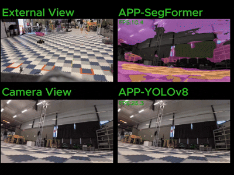
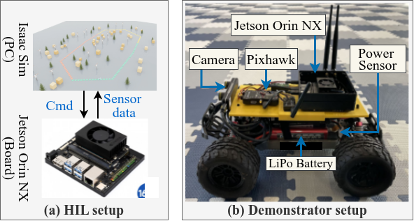

# Repository Structure

```text
AsyncMEC/
├── appls/                 # Robotic application workloads
├── assets/                # Demo overview
├── battery_feature/       # Battery condition feature extraction and related utilities
├── checkpoints/           # Pretrained checkpoints for battery, controller, and appls models
├── configs/               # Jetson Orin NX configurations
├── envs/                  # Jetson Orin NX platform interfaces and robot simulation environments
├── exps/                  # Experiment scripts and analysis utilities
├── methods/               # AsyncMEC controller and baseline methods
├── ros2_isaacsim_env/     # ROS 2 + Isaac Sim integration for HIL and simulation experiments
├── train/                 # Data generation and training scripts
├── README.md              # Project overview and usage notes
```

# Supported Workloads and Platforms

## Supported application workloads
The current supported workloads include:
- YOLOv8
- SegFormer

Additional workloads, including applications based on the ZED SDK, are planned for future extensions.

## Training and runtime control
The framework supports CPU and GPU dynamic voltage and frequency scaling (DVFS) and power monitoring on the Jetson Orin NX. It can also estimate power consumption and application performance using linear models fitted to hardware measurements for training and evaluation without requiring physical hardware at all times.

# Simulation and Evaluation

<p align="center">
  
  &nbsp;&nbsp;&nbsp;&nbsp;&nbsp;&nbsp;&nbsp;&nbsp;&nbsp;&nbsp;&nbsp;&nbsp;
  
</p>

We use Isaac Sim 6 together with the Jetson Orin NX to build a hardware-in-the-loop (HIL) evaluation platform. Isaac Sim simulates rover motion and sensor observations, while the controller and application workloads run on the Jetson Orin NX. The two sides communicate through ROS 2, enabling runtime control and evaluation under realistic compute and dynamics constraints.

The ROS 2 + Isaac Sim environment is organized under [ros2_isaacsim_env/README.md](ros2_isaacsim_env/README.md). The included launcher scripts support both fixed-complexity and varying-complexity simulation modes.

# Datasets and Training Data

## Battery condition feature pretraining data
Battery models are trained using NASA battery datasets.
Dataset link: [NASA Li-ion Battery Aging Datasets](https://data.nasa.gov/dataset/li-ion-battery-aging-datasets)

## Controller training pipeline
Controller training data are generated through the following steps:

1. Profile computational workloads across CPU and GPU frequency settings on the Jetson Orin NX.
2. Build energy models to estimate computational and mechanical power consumption under different operating conditions.
3. Evaluate candidate control decisions using the resulting models and generate labels for controller training.

# Checkpoints

Pretrained model checkpoints are not included in this repository during the anonymous review process. They will be released after paper acceptance.

Included checkpoints target:

- Application models ([YOLOv8](https://yolov8.com/) and [SegFormer](https://github.com/NVlabs/SegFormer)).
- Battery feature extractor.
- Controller model.

# Acknowledgments

We thank the developers of the following open-source projects for their contributions and inspiration:

- [MAVBench](https://github.com/harvard-edge/MAVBench), which inspired the development of the AsyncMEC hardware-in-the-loop simulator.
- [battery-soh-models](https://github.com/sajadshah/battery-soh-models), which inspired the design of the battery models used in this work.
